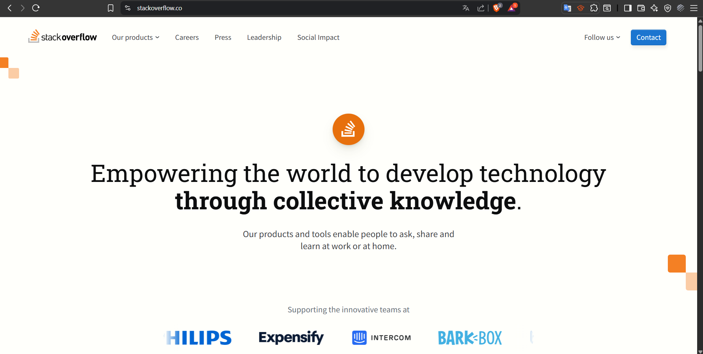

# Checkpoint 1: Prototipo y estructura inicial

Inicialmente se nos dieron 3 proyectos a escoger: 

- “StudentOverflow”: Portal web que permitirá que un usuario haga una pregunta de materia para que los demás usuarios de la plataforma puedan ayudarla o ayudarlo. Esta plataforma está inspirada en StackOverflow, el portal de preguntas y respuestas más utilizado en el mundo por desarrolladores y desarrolladoras de software. 

- “PopcornHour”: portal web para recomendar, calificar y discutir sobre películas y series. Existirán dos tipos de usuarios: moderador y estándar. Los usuarios de tipo “moderador” contarán con la posibilidad para subir películas que los usuarios de tipo estándar puedan calificar, comentar y discutir

- “Quadra”: aplicación para ubicar y calificar puestos de comida en la calle. Todos los usuarios podrán subir puestos de comida con su ubicación georeferenciada, una breve reseña y una foto del mismo. Los demás usuarios de Quadra podrán calificar y comentar sobre los puestos que otros usuarios han creado.

De los cuales escogí por desarrollar **StudentOverflow**.

## Objetivo
Desarrollar una aplicación web full-stack en lenguaje Python en la que hagan uso de control de versiones en Github, bases de datos relacionales, mecanismos de autenticación y autorización y despliegue de software a entornos productivos.

## Prototipo
Dado que la plataforma está inspirada en **StackOverflow**, he realizado un primer análisis de investigación para conocer algunas de las funciones principales que integra esta plataforma a fin de decidir cuales de incluirían dentro de **StudentOverflow**.

***Figura 1.** Inicio StackOverflow*

***Figura 2.** Questions StackOverflow*

Una ves que identifique esas funciones que si o si debería tener un software como **StudentOverflow** procedí a hacer una lista de esas funciones principales que debería tener así como los requerimientos.

- Inicio de Sesión
- Registro
- Busqueda
- Ver preguntas
- Preguntar
- Ver etiquetas
- Ver perfil

Por lo que dicho esto me di a la tarea de elaborar una maqueta, mi primera opción fue usar **Figma**, sin embargo, esta a pesar de ser una excelente opción, decidí usar **Stitch** una plataforma recientemente adquirida por **Google**, que se enfoca en diseñar IU (Interfaces de Usuario) con Inteligencia Artificial. [Stitch](https://developers.googleblog.com/es/stitch-a-new-way-to-design-uis/)

<iframe width="560" height="315" src="https://www.youtube.com/embed/q39uczIW_MY?si=VX-rrkQhcPbz38TT" title="YouTube video player" frameborder="0" allow="accelerometer; autoplay; clipboard-write; encrypted-media; gyroscope; picture-in-picture; web-share" referrerpolicy="strict-origin-when-cross-origin" allowfullscreen></iframe>

Finalmente obteniendo una primer maqueta de la página Web.

***Figura 3.** Maqueta Página Web **Stitch***
