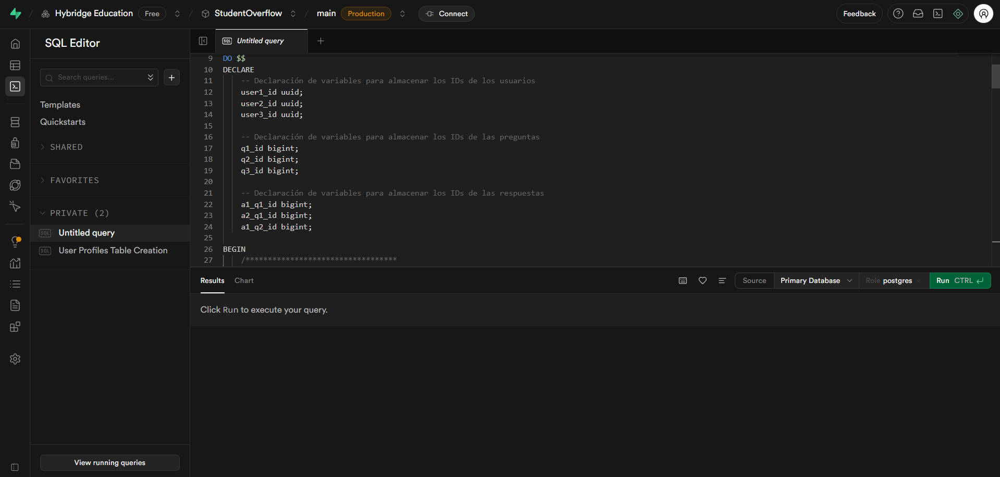

# Checkpoint 2: Diseño inicial de la base de datos y flujos de usuario
Para la creación de la base de datos se hizo uso de [Supabase](https://supabase.com/).

## Esquema entidad-relación de la base de datos que utilizará la aplicación

***Figura 1.** Esquema entidad-relación de la base de datos en **Supabase***

Adicionalmente, para efectos prácticos y para pruebas de funcionalidad se relleno la base de datos con información ficticia. Esto se hizo ingresando información a partir de **SQL**, los datos fueron ingresados usando el **Editor de SQL** de **Supabase.**

***Figura 2.** Ingreso de datos a partir del **SQL Editor***

---

## Diagramas de flujo de los distintos casos de uso que los usuarios podrán ejecutar en la plataforma
Para la creación de cada uno de los diagramas de flujo se uso [Mermaid](https://www.mermaidchart.com/app/dashboard).

### 📥 1. Diagrama de Flujo: Registro de un Nuevo Usuario
Este diagrama muestra el proceso desde que un usuario decide registrarse hasta que se le pide que verifique su correo electrónico.

***Figura 3.** Registro de un Nuevo Usuario*

### 🔑 2. Diagrama de Flujo: Inicio de Sesión de un Usuario
Este es el proceso para un usuario que ya tiene una cuenta.

***Figura 4.** Inicio de Sesión de un Usuario*

### ❓ 3. Diagrama de Flujo: Publicar una Nueva Pregunta
Este flujo describe los pasos que sigue un usuario autenticado para crear una nueva pregunta.

***Figura 5.** Publicar una Nueva Pregunta^*

### 💬 4. Diagrama de Flujo: Publicar una Respuesta
Aquí se muestra cómo un usuario puede responder a una pregunta existente.

***Figura 6.** Publicar una Respuesta*

👍 5. Diagrama de Flujo: Votar en una Publicación
Este flujo cubre tanto los votos positivos como los negativos en preguntas o respuestas.

***Figura 7.*** Votar en una Publicación*

✅ 6. Diagrama de Flujo: Marcar Mejor Respuesta
Solo el autor de la pregunta puede realizar esta acción.

***Figura 8.** Marcar Mejor Respuesta*
