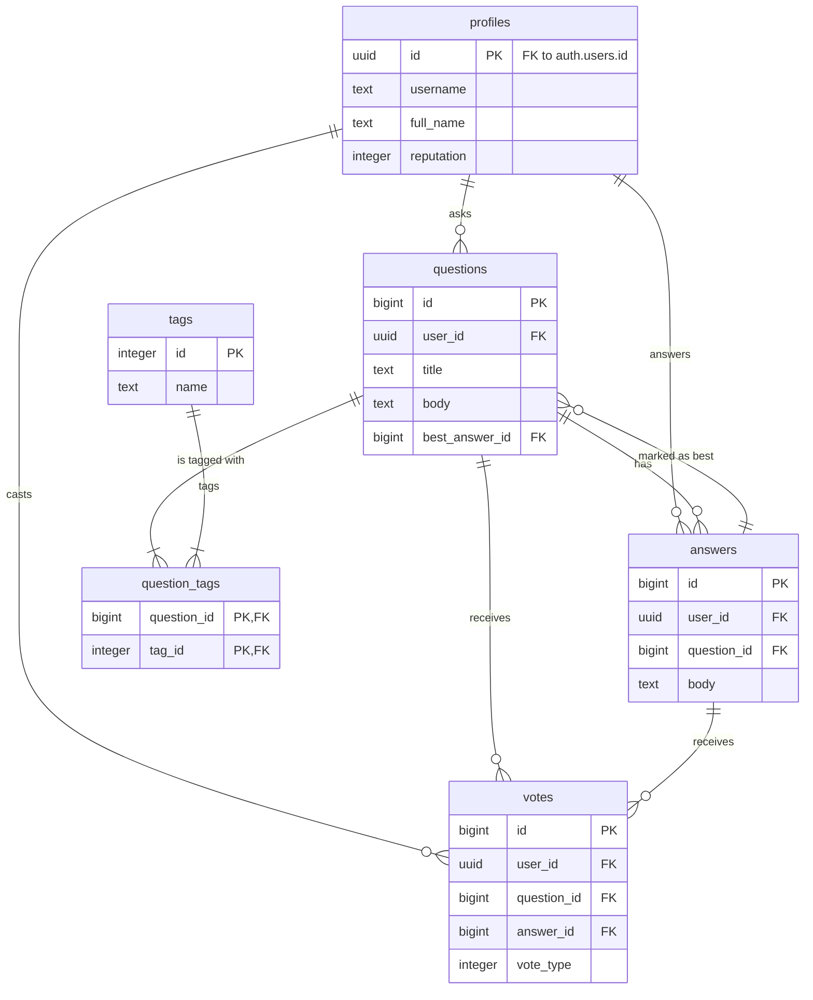

# Propuesta de Esquema de Base de Datos
El diseño se centra en separar las preocupaciones: la autenticación la maneja Supabase de forma nativa en su esquema `auth`, mientras que los datos de nuestra aplicación vivirán en el esquema `public`. Nos conectaremos al sistema de autenticación a través del UUID del usuario.

Diagrama de Relación de Entidades (ERD)
Este diagrama muestra cómo se conectan las tablas entre sí:



-----

# Vamos a usar el **SQL Editor** de Supabase para crear nuestra base de datos.

### **Paso 1: 👤 Crear la Tabla `profiles`**

Esta tabla es fundamental, ya que se conecta con el sistema de autenticación de Supabase.

**Copia y ejecuta este código:**

```sql
-- 1. Crear la tabla de perfiles
CREATE TABLE profiles (
  id uuid PRIMARY KEY REFERENCES auth.users(id) ON DELETE CASCADE,
  username TEXT UNIQUE NOT NULL,
  full_name TEXT,
  reputation INT DEFAULT 0 NOT NULL,
  created_at TIMESTAMPTZ DEFAULT NOW() NOT NULL,

  CONSTRAINT username_length CHECK (char_length(username) >= 3)
);

-- Comentario para la tabla
COMMENT ON TABLE profiles IS 'Almacena los perfiles públicos de los usuarios.';
```

  * **¿Qué hace este código?** Crea la tabla `profiles` y establece que la columna `id` es una referencia directa al `id` de un usuario en el sistema de autenticación (`auth.users`). Si un usuario se elimina de `auth`, su perfil también se eliminará en cascada.

### **Paso 2: ❓ Crear la Tabla `questions`**

Aquí se guardarán todas las preguntas de la plataforma.

**Copia y ejecuta este código:**

```sql
-- 2. Crear la tabla de preguntas
CREATE TABLE questions (
  id BIGINT PRIMARY KEY GENERATED ALWAYS AS IDENTITY,
  user_id uuid NOT NULL REFERENCES profiles(id) ON DELETE CASCADE,
  title TEXT NOT NULL,
  body TEXT NOT NULL,
  best_answer_id BIGINT, -- Se añadirá la referencia FK después de crear la tabla de respuestas
  created_at TIMESTAMPTZ DEFAULT NOW() NOT NULL
);

-- Comentario para la tabla
COMMENT ON TABLE questions IS 'Contiene todas las preguntas formuladas por los usuarios.';
```

  * **¿Qué hace este código?** Crea la tabla `questions` y la vincula a la tabla `profiles` para saber qué usuario hizo cada pregunta. Dejamos la `best_answer_id` sin su referencia por ahora, ya que la tabla `answers` aún no existe.

### **Paso 3: 💬 Crear la Tabla `answers` y Vincularla**

Ahora, la tabla para las respuestas. Después de crearla, actualizaremos la tabla `questions` para finalizar el vínculo.

**Copia y ejecuta este código (son dos partes):**

```sql
-- 3.1. Crear la tabla de respuestas
CREATE TABLE answers (
  id BIGINT PRIMARY KEY GENERATED ALWAYS AS IDENTITY,
  user_id uuid NOT NULL REFERENCES profiles(id) ON DELETE CASCADE,
  question_id BIGINT NOT NULL REFERENCES questions(id) ON DELETE CASCADE,
  body TEXT NOT NULL,
  created_at TIMESTAMPTZ DEFAULT NOW() NOT NULL
);

-- Comentario para la tabla
COMMENT ON TABLE answers IS 'Contiene las respuestas a las preguntas.';

-- 3.2. Añadir la clave foránea que faltaba en la tabla 'questions'
ALTER TABLE questions
ADD CONSTRAINT fk_best_answer
FOREIGN KEY (best_answer_id)
REFERENCES answers(id)
ON DELETE SET NULL;
```

  * **¿Qué hace este código?** Primero, crea la tabla `answers` vinculada a `profiles` y `questions`. Segundo, actualiza la tabla `questions` para que `best_answer_id` apunte correctamente a un `id` de la tabla `answers`. Si una respuesta "mejor" se elimina, el campo en la pregunta simplemente se volverá nulo.

### **Paso 4: 🏷️ Crear las Tablas para Etiquetas (`tags` y `question_tags`)**

Implementaremos el sistema de etiquetado con una relación muchos-a-muchos.

**Copia y ejecuta este código:**

```sql
-- 4.1. Crear tabla de etiquetas
CREATE TABLE tags (
  id INT PRIMARY KEY GENERATED ALWAYS AS IDENTITY,
  name TEXT UNIQUE NOT NULL,
  description TEXT
);

-- Comentario para la tabla
COMMENT ON TABLE tags IS 'Catálogo de todas las etiquetas disponibles.';

-- 4.2. Crear tabla de unión para preguntas y etiquetas
CREATE TABLE question_tags (
  question_id BIGINT NOT NULL REFERENCES questions(id) ON DELETE CASCADE,
  tag_id INT NOT NULL REFERENCES tags(id) ON DELETE CASCADE,
  PRIMARY KEY (question_id, tag_id)
);

-- Comentario para la tabla
COMMENT ON TABLE question_tags IS 'Tabla de unión para la relación muchos-a-muchos entre preguntas y etiquetas.';
```

  * **¿Qué hace este código?** Crea una tabla `tags` para almacenar todas las etiquetas únicas y una tabla de unión `question_tags` para poder asignar múltiples etiquetas a una misma pregunta.

### **Paso 5: 👍 Crear la Tabla `votes`**

Esta tabla registrará los votos en preguntas y respuestas.

**Copia y ejecuta este código:**

```sql
-- 5. Crear tabla de votos
CREATE TABLE votes (
  id BIGINT PRIMARY KEY GENERATED ALWAYS AS IDENTITY,
  user_id uuid NOT NULL REFERENCES profiles(id) ON DELETE CASCADE,
  question_id BIGINT REFERENCES questions(id) ON DELETE CASCADE,
  answer_id BIGINT REFERENCES answers(id) ON DELETE CASCADE,
  vote_type SMALLINT NOT NULL CHECK (vote_type IN (1, -1)),

  -- Un usuario solo puede votar una vez por publicación
  UNIQUE (user_id, question_id),
  UNIQUE (user_id, answer_id),
  
  -- Solo se puede votar por una pregunta O una respuesta, no ambas
  CONSTRAINT vote_target CHECK (
    (question_id IS NOT NULL AND answer_id IS NULL) OR
    (question_id IS NULL AND answer_id IS NOT NULL)
  )
);

-- Comentario para la tabla
COMMENT ON TABLE votes IS 'Registra los votos (positivos/negativos) en preguntas o respuestas.';
```

  * **¿Qué hace este código?** Crea la tabla `votes` y contiene restricciones clave: un voto debe ser `1` o `-1`, un usuario no puede votar dos veces en la misma publicación y un voto solo puede pertenecer a una pregunta o a una respuesta, no a ambas.

### **Paso 6: 🔐 Activar Row-Level Security (RLS)**

Este es el paso de seguridad más importante. Por defecto, tu data es accesible. Con RLS, se vuelve privada y tú defines las reglas de acceso.

**Copia y ejecuta este código:**

```sql
-- 6. Activar RLS para cada tabla
ALTER TABLE profiles ENABLE ROW LEVEL SECURITY;
ALTER TABLE questions ENABLE ROW LEVEL SECURITY;
ALTER TABLE answers ENABLE ROW LEVEL SECURITY;
ALTER TABLE tags ENABLE ROW LEVEL SECURITY;
ALTER TABLE question_tags ENABLE ROW LEVEL SECURITY;
ALTER TABLE votes ENABLE ROW LEVEL SECURITY;
```

-----

# (Opcional) Agregar datos ficticios a la Base de Datos

```sql
/****************************************************************
* Ejecútalo completo en el SQL Editor de Supabase.         *
****************************************************************/

DO $$
DECLARE
    -- Declaración de variables para almacenar los IDs de los usuarios
    user1_id uuid;
    user2_id uuid;
    user3_id uuid;
    
    -- Declaración de variables para almacenar los IDs de las preguntas
    q1_id bigint;
    q2_id bigint;
    q3_id bigint;
    
    -- Declaración de variables para almacenar los IDs de las respuestas
    a1_q1_id bigint;
    a2_q1_id bigint;
    a1_q2_id bigint;

BEGIN
    /*************************************************
    * PASO 1: CREAR USUARIOS Y PERFILES
    **************************************************/
    
    -- --- Crear Usuario 1: Ana ---
    user1_id := gen_random_uuid();
    INSERT INTO auth.users (id, aud, role, email, encrypted_password, email_confirmed_at)
    VALUES (user1_id, 'authenticated', 'authenticated', 'ana.perez@example.com', crypt('password123', gen_salt('bf')), NOW());
    
    -- --- CORRECCIÓN FINAL: Añadida la columna 'provider_id' ---
    INSERT INTO auth.identities (id, user_id, provider_id, provider, identity_data)
    VALUES (gen_random_uuid(), user1_id, 'ana.perez@example.com', 'email', format('{"sub":"%s","email":"ana.perez@example.com"}', user1_id)::jsonb);
    
    INSERT INTO profiles (id, username, full_name, reputation)
    VALUES (user1_id, 'anaperez', 'Ana Pérez', 150);

    -- --- Crear Usuario 2: Carlos ---
    user2_id := gen_random_uuid();
    INSERT INTO auth.users (id, aud, role, email, encrypted_password, email_confirmed_at)
    VALUES (user2_id, 'authenticated', 'authenticated', 'carlos.gomez@example.com', crypt('password123', gen_salt('bf')), NOW());

    -- --- CORRECCIÓN FINAL: Añadida la columna 'provider_id' ---
    INSERT INTO auth.identities (id, user_id, provider_id, provider, identity_data)
    VALUES (gen_random_uuid(), user2_id, 'carlos.gomez@example.com', 'email', format('{"sub":"%s","email":"carlos.gomez@example.com"}', user2_id)::jsonb);

    INSERT INTO profiles (id, username, full_name, reputation)
    VALUES (user2_id, 'carlosg', 'Carlos Gómez', 75);

    -- --- Crear Usuario 3: Sofía ---
    user3_id := gen_random_uuid();
    INSERT INTO auth.users (id, aud, role, email, encrypted_password, email_confirmed_at)
    VALUES (user3_id, 'authenticated', 'authenticated', 'sofia.rodriguez@example.com', crypt('password123', gen_salt('bf')), NOW());

    -- --- CORRECCIÓN FINAL: Añadida la columna 'provider_id' ---
    INSERT INTO auth.identities (id, user_id, provider_id, provider, identity_data)
    VALUES (gen_random_uuid(), user3_id, 'sofia.rodriguez@example.com', 'email', format('{"sub":"%s","email":"sofia.rodriguez@example.com"}', user3_id)::jsonb);
    
    INSERT INTO profiles (id, username, full_name, reputation)
    VALUES (user3_id, 'sofiar', 'Sofía Rodríguez', 220);

    /*****************************
    * PASO 2: CREAR ETIQUETAS
    *****************************/
    INSERT INTO tags (name, description) VALUES
    ('javascript', 'Preguntas sobre el lenguaje de programación JavaScript.'),
    ('react', 'Preguntas relacionadas con la librería de Facebook para construir interfaces de usuario.'),
    ('supabase', 'Preguntas sobre la plataforma de Backend como Servicio Supabase.'),
    ('sql', 'Preguntas sobre el Lenguaje de Consulta Estructurado para bases de datos.'),
    ('python', 'Preguntas sobre el lenguaje de programación Python.'),
    ('html', 'Preguntas sobre el Lenguaje de Marcado de Hipertexto.'),
    ('css', 'Preguntas sobre Hojas de Estilo en Cascada para el diseño web.');

    /****************************
    * PASO 3: CREAR PREGUNTAS
    ****************************/
    INSERT INTO questions (user_id, title, body)
    VALUES (user1_id, '¿Cómo puedo centrar un div vertical y horizontalmente con CSS?', 'He intentado varias combinaciones con Flexbox y Grid, pero no logro que un div quede perfectamente centrado en la página. ¿Cuál es el método más moderno y confiable para lograrlo?')
    RETURNING id INTO q1_id;

    INSERT INTO questions (user_id, title, body)
    VALUES (user2_id, 'Diferencia entre `let`, `const` y `var` en JavaScript', 'Soy nuevo en JavaScript y veo que hay tres formas de declarar variables. ¿Podrían explicarme la diferencia en el alcance (scope) y la mutabilidad de cada una?')
    RETURNING id INTO q2_id;
    
    INSERT INTO questions (user_id, title, body)
    VALUES (user1_id, '¿Cómo configurar Row-Level Security en Supabase para un blog?', 'Estoy construyendo un blog y quiero que los usuarios solo puedan editar sus propias publicaciones. ¿Cómo puedo crear la política (POLICY) correcta en Supabase para lograr esto?')
    RETURNING id INTO q3_id;

    /************************************
    * PASO 4: ASIGNAR ETIQUETAS
    ************************************/
    INSERT INTO question_tags (question_id, tag_id) VALUES
    (q1_id, (SELECT id FROM tags WHERE name = 'css')),
    (q1_id, (SELECT id FROM tags WHERE name = 'html')),
    (q2_id, (SELECT id FROM tags WHERE name = 'javascript')),
    (q3_id, (SELECT id FROM tags WHERE name = 'supabase')),
    (q3_id, (SELECT id FROM tags WHERE name = 'sql'));

    /****************************
    * PASO 5: CREAR RESPUESTAS
    ****************************/
    INSERT INTO answers (user_id, question_id, body)
    VALUES (user3_id, q1_id, '¡Claro! La forma más sencilla hoy en día es usando CSS Grid. Simplemente aplica `display: grid;` y `place-items: center;` al contenedor padre. ¡Y listo!')
    RETURNING id INTO a1_q1_id;
    
    INSERT INTO answers (user_id, question_id, body)
    VALUES (user2_id, q1_id, 'Con Flexbox también es muy fácil. En el contenedor, usa: `display: flex;`, `justify-content: center;`, `align-items: center;`. Asegúrate de que el contenedor tenga un alto definido, por ejemplo `min-height: 100vh;`.')
    RETURNING id INTO a2_q1_id;

    INSERT INTO answers (user_id, question_id, body)
    VALUES (user1_id, q2_id, '¡Buena pregunta! En resumen: `var` tiene alcance de función y se puede redeclarar. `let` y `const` tienen alcance de bloque (`{}`). La principal diferencia es que las variables declaradas con `const` no se pueden reasignar. Hoy en día, se recomienda usar `const` por defecto y `let` solo si sabes que la variable necesita cambiar de valor.')
    RETURNING id INTO a1_q2_id;
    
    /************************************
    * PASO 6: MARCAR MEJOR RESPUESTA
    ************************************/
    UPDATE questions SET best_answer_id = a1_q1_id WHERE id = q1_id;

    /****************************
    * PASO 7: AGREGAR VOTOS
    ****************************/
    INSERT INTO votes (user_id, question_id, vote_type) VALUES (user2_id, q1_id, 1);
    INSERT INTO votes (user_id, question_id, vote_type) VALUES (user3_id, q1_id, 1);
    INSERT INTO votes (user_id, answer_id, vote_type) VALUES (user1_id, a1_q1_id, 1);
    INSERT INTO votes (user_id, answer_id, vote_type) VALUES (user2_id, a1_q1_id, 1);
    INSERT INTO votes (user_id, answer_id, vote_type) VALUES (user1_id, a2_q1_id, 1);
    INSERT INTO votes (user_id, question_id, vote_type) VALUES (user1_id, q2_id, 1);
    
END $$;
```

