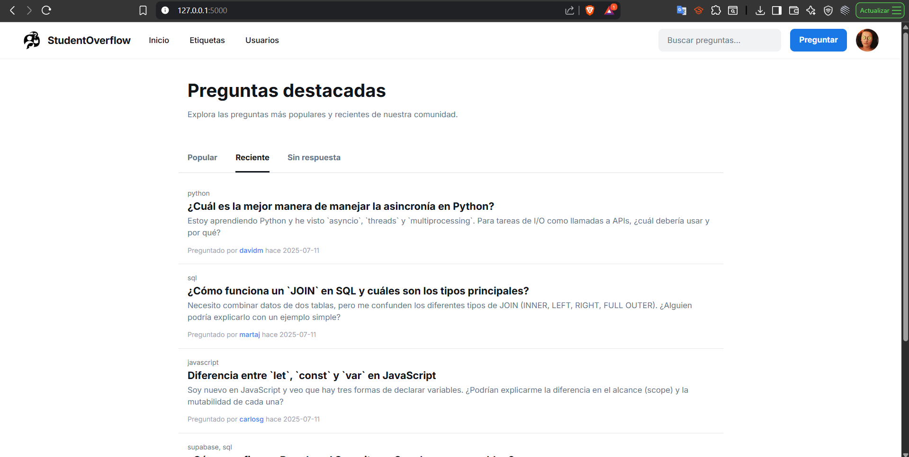
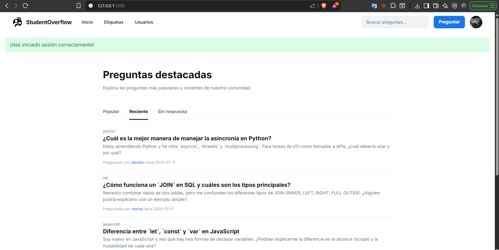
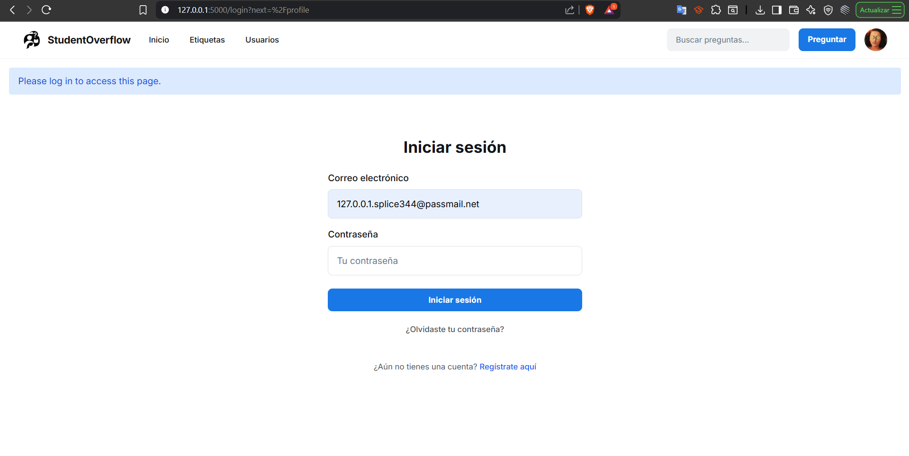
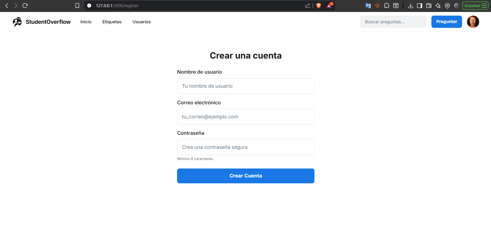

# Checkpoint 3: Desarrollo de landing page, login y sign up

## 1. Capturas de pantalla de las siguientes vistas desarrolladas e implementadas:

### Página de inicio para usuarios sin sesión iniciada

***Figura 1.** Página de inicio para usuarios sin sesión iniciada*

### Página de inicio para usuarios con sesión iniciada

***Figura 2.** Página de inicio para usuarios con sesión iniciada*

### Inicio de sesión

***Figura 3.** LOGIN Usuarios*

### Registro de usuario (nuevos usuarios)

***Figura 4.** REGISTRO Nuevos Usuarios*

## 2. Grabación de pantalla que muestre el flujo completo de cómo un usuario puede navegar en la plataforma hasta este punto.

> *Ver el [Video](https://youtu.be/cSdZ-Fa49vU)*
