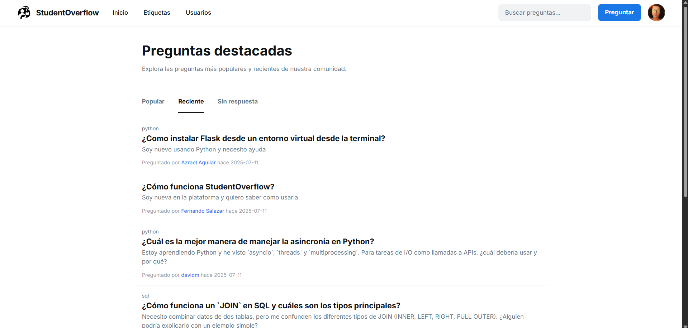
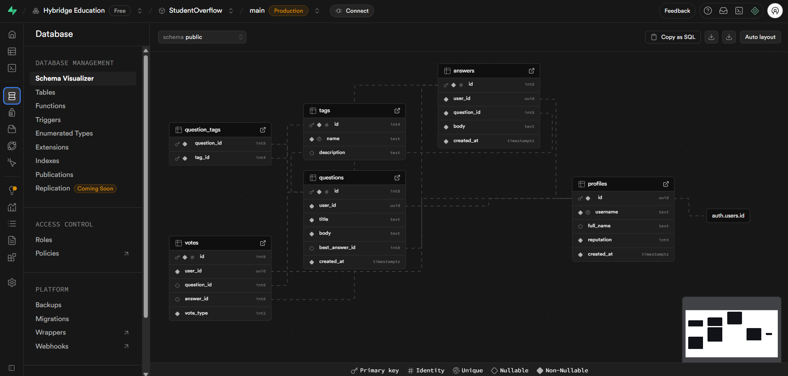
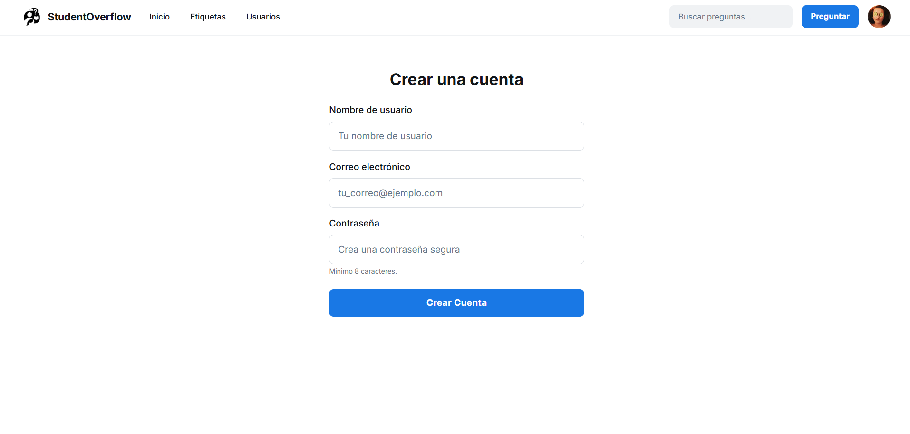
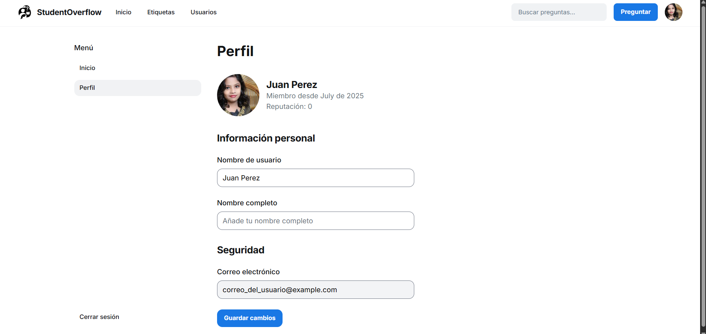
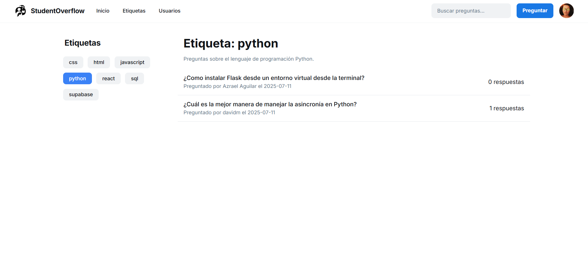
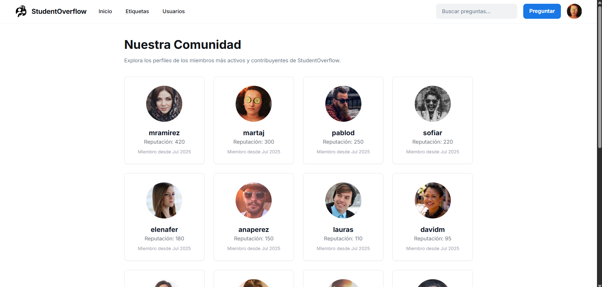
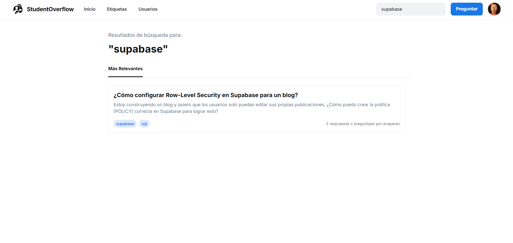

# 🎓 StudentOverflow: Plataforma de Preguntas y Respuestas

[](https://www.hybridge.education)


**StudentOverflow** es una aplicación web completa y funcional, inspirada en Stack Overflow, diseñada para que una comunidad de estudiantes pueda hacer preguntas, compartir conocimientos y construir una base de datos de respuestas útiles. El desarrollo de esta aplicación **Full-Stack** corresponde al **Proyecto Final** de la asignatura de **Programación Avanzada** en [Hybridge Education](https://www.hybridge.education).


***Figura 1.** Página de Inicio*

El proyecto está construido con un backend de **Python** usando el micro-framework **Flask**, y se conecta a una base de datos **PostgreSQL** gestionada por **Supabase**, que también maneja la autenticación de usuarios.

## ✨ Características Principales

-   **👤 Autenticación y Sesiones:** Sistema completo de registro, inicio y cierre de sesión utilizando Supabase Auth y Flask-Login.
-   **📝 Gestión de Contenido:** Los usuarios pueden crear, ver y responder preguntas.
-   **🏷️ Sistema de Etiquetas:** Cada pregunta puede ser categorizada con múltiples etiquetas para una fácil clasificación y búsqueda.
-   **👥 Comunidad de Usuarios:** Una página dedicada para explorar los perfiles de todos los miembros de la comunidad.
-   **🔍 Búsqueda Funcional:** Una barra de búsqueda que permite encontrar preguntas por palabras clave en el título o cuerpo.
-   **👤 Perfiles de Usuario:** Cada usuario tiene una página de perfil donde puede actualizar su información.
-   **🔐 Backend Seguro:** Uso de Blueprints para una arquitectura modular, gestión de sesiones segura y preparación para políticas de acceso a datos (RLS).

---

## 🏗️ Arquitectura del Proyecto

El proyecto utiliza una arquitectura modular basada en el patrón de **Application Factory** y **Blueprints** en Flask. Esto separa las funcionalidades en componentes lógicos, facilitando el mantenimiento y la escalabilidad.

### Estructura de Archivos
```

/StudentOverflow
├── app.py             \# Fábrica de la aplicación Flask
├── run.py             \# Punto de entrada para ejecutar el servidor
├── config.py          \# Configuración (claves, URI de la BD)
├── models.py          \# Modelos de la base de datos (SQLAlchemy)
├── extensions.py      \# Instancias de las extensiones (db, login\_manager)
├── /routes            \# Contiene los Blueprints con las rutas
│   ├── auth\_routes.py
│   ├── question\_routes.py
│   └── ... (y los demás archivos de rutas)
├── /templates         \# Plantillas HTML con Jinja2
│   ├── base.html
│   ├── index.html
│   └── ... (y las demás plantillas)
├── /static
|   ├── /images
|   |   ├── logo.png
└── requirements.txt   \# Dependencias de Python

````

### Diagrama de la Base de Datos

La base de datos es relacional y está diseñada para conectar lógicamente a los usuarios con sus contribuciones.

```mermaid
erDiagram
    profiles {
        uuid id PK "FK to auth.users.id"
        text username
        text full_name
        integer reputation
    }
    questions {
        bigint id PK
        uuid user_id FK
        text title
        text body
    }
    answers {
        bigint id PK
        uuid user_id FK
        bigint question_id FK
        text body
    }
    tags {
        integer id PK
        text name
    }
    question_tags {
        bigint question_id PK, FK
        integer tag_id PK, FK
    }
    profiles ||--o{ questions : "formula"
    profiles ||--o{ answers : "responde"
    questions ||--o{ answers : "recibe"
    questions }|--|{ question_tags : "etiquetada con"
    tags }|--|{ question_tags : "etiqueta a"
````

***Figura 2.** Diagrama de la BD*


***Figura 3.** Base de Datos SUPABASE*

-----

## 🚀 Instalación y Puesta en Marcha

Sigue estos pasos para ejecutar el proyecto en tu entorno local.

### 1\. Prerrequisitos

  * Python 3.8 o superior.
  * `pip` y `venv` instalados.
  * Una cuenta de [Supabase](https://supabase.com/).

### 2\. Clonar el Repositorio

```bash
git clone https://github.com/jesusvasquezjr3/StudentOverflow
cd StudentOverflow
```

### 3\. Configurar el Entorno Virtual

```bash
# Crear el entorno virtual
python -m venv venv

# Activar en Windows
.\venv\Scripts\activate

# Activar en macOS/Linux
source venv/bin/activate
```

### 4\. Instalar Dependencias

```bash
pip install -r requirements.txt
```

### 5\. Configurar la Base de Datos en Supabase

#### a. Crear el Esquema

  * Ve a tu proyecto de Supabase y navega al **SQL Editor**.
  * Crea un nuevo query y pega el contenido del script que creamos para **crear todas las tablas y activar RLS**. Ejecútalo.

#### b. Configurar Variables de Entorno

  * En la raíz de tu proyecto, crea un archivo llamado `.env`. Este archivo guardará tus claves secretas de forma segura.

  * Copia el siguiente contenido en tu archivo `.env`:

    ```env
    # .env.example

    # Pega aquí la URI de conexión de tu base de datos de Supabase
    DATABASE_URL="postgresql://postgres:[TU_CONTRASEÑA]@[ID_PROYECTO].db.supabase.co:5432/postgres"

    # Clave secreta para Flask (puedes generar una con `openssl rand -hex 16`)
    SECRET_KEY="una-clave-muy-segura-y-aleatoria"

    # Claves de la API de tu proyecto de Supabase (en Project Settings > API)
    SUPABASE_URL="https://[ID_PROYECTO].supabase.co"
    SUPABASE_KEY="[TU_CLAVE_PUBLICA_ANON]"
    ```

  * **Importante:** Reemplaza los valores entre `[...]` con tus propias claves de Supabase. El archivo `config.py` está configurado para leer estas variables automáticamente.

### 6\. Ejecutar la Aplicación

Con tu entorno virtual activado y el archivo `.env` configurado, inicia el servidor:

```bash
python run.py
```

La aplicación estará disponible en `http://127.0.0.1:5000`.

-----

## 🌊 Funcionamiento


***Figura 4.** Inicio de Sesión*


***Figura 5.** Crear nuevo usuario*


***Figura 6.** Perfil usuario*


***Figura 7.** Etiquetas de publicaciones*


***Figura 8.** Ver a los usuarios de la plataforma*


***Figura 9.** Publicar una Pregunta*


***Figura 10.** Buscar una pregunta*

## 📜 Licencia MIT
Copyright © 2025 Jesús Vásquez - Hybridge Education

Este proyecto es material académico desarrollado como parte del programa educativo de Hybridge Education.

